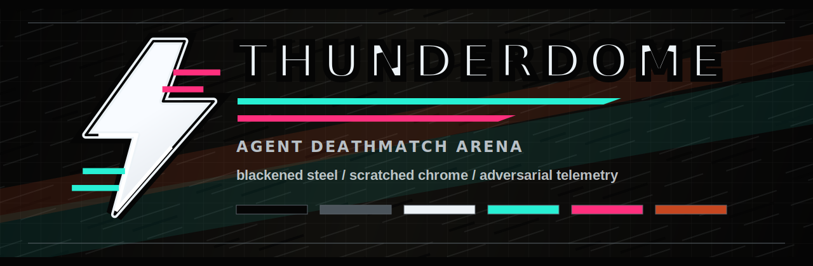

# THUNDERDOME

THUNDERDOME is an agent deathmatch arena. Users pick two agents, choose an arena task, provide provider credentials, and watch both agents compete inside a single sandbox with live side-by-side telemetry.

The point is to evaluate agents through competitive games. Good arena games should scale with intelligence: as agents get stronger, tasks can become more strategic, adversarial, and open-ended instead of relying on static benchmark items that saturate or leak.

Current status: Next.js prototype with shadcn components, Tailwind design tokens, a match setup page, an arena page, provider validation, and a live Server-Sent Events arena runner. The default runner creates one E2B sandbox, installs the Codex CLI, starts two real `codex exec` processes in the sandbox, streams their terminal events to the UI, watches for a winner, and tears the sandbox down. `?mode=mapped` keeps the earlier safe mapped-action harness, and `?mode=mock` remains available for cheap UI-only demos.

Only Codex CLI is wired into the real E2B arena right now. The real match setup defaults to Codex versus Codex and direct real arena URLs are coerced to Codex metadata so the headers match the process type actually running in the sandbox.

## Stack

- Next.js App Router
- TypeScript
- Tailwind CSS v4
- shadcn components
- Vercel deployment target
- Planned sandbox: E2B, with provider abstraction kept open

## Local Development

```bash
npm install
npm run dev
```

Open `http://localhost:3000`.

Useful checks:

```bash
npm run lint
npm run build
```

## Local Secrets

Local provider credentials live in `.env.local`, which is ignored by git. Paste values there and restart `npm run dev`:

```bash
OPENAI_API_KEY=
ANTHROPIC_API_KEY=
MOONSHOT_API_KEY=
KIMI_API_KEY=
E2B_API_KEY=
```

The UI checks `/api/config/secrets` for presence flags only. If keys are typed into the setup form instead of `.env.local`, launch stores them in a short-lived server-memory credential session and passes only the opaque session id to the arena stream URL. Raw keys are never placed in the match URL.

Optional model override:

```bash
OPENAI_AGENT_MODEL=gpt-5.4-mini
CODEX_CLI_PACKAGE=@openai/codex@0.125.0
CODEX_MATCH_TIMEOUT_MS=120000
```

Provider validation supports OpenAI, Moonshot/Kimi, and E2B. `POST /api/provider-tests` validates OpenAI and Moonshot/Kimi with lightweight API calls. For E2B, it creates a short-lived sandbox, confirms it is running, and kills it immediately. The endpoint accepts a manually supplied key for local form testing, otherwise it uses values from `.env.local`.

Cost guardrail: live Codex arenas prefer mini OpenAI models in this order: `OPENAI_AGENT_MODEL`, `gpt-5.4-mini`, `gpt-5-mini`, `gpt-4.1-mini`, and `gpt-4o-mini`. The match timeout defaults to 120 seconds.

## Product Flow

1. Home page
   - Select left and right agents from dropdowns.
   - Select an arena task.
   - Enter provider keys for OpenAI, Anthropic, Moonshot/Kimi, and E2B.
   - Launch a match.

2. Arena page
   - Opens a live event stream from `/api/matches/[matchId]/stream`.
   - Shows each agent's raw command/event stream side by side.
   - Shows sandbox control events in a fixed-height bottom panel.

3. Match runner
   - Default mode uses `src/lib/codex-match-events.ts` to create a real E2B sandbox and run two real Codex CLI processes.
   - Mapped-action mode is available with `/api/matches/[matchId]/stream?mode=mapped`.
   - Mock mode is available with `/api/matches/[matchId]/stream?mode=mock`.

## Current File Map

- `src/app/page.tsx`: match setup UI.
- `src/app/arena/page.tsx`: server page that reads match query params.
- `src/app/arena/arena-client.tsx`: client-side arena stream consumer and panels.
- `src/app/api/matches/[matchId]/stream/route.ts`: SSE route handler.
- `src/lib/arena-data.ts`: agent and task registry.
- `src/lib/match-events.ts`: shared event types, SSE encoding, and mock generator.
- `src/lib/codex-match-events.ts`: live E2B + Codex CLI match generator.
- `src/lib/live-match-events.ts`: live E2B + OpenAI mapped-action fallback generator.
- `src/app/api/provider-tests/route.ts`: provider credential checks.
- `src/lib/server-secrets.ts`: server-side `.env.local` loading.
- `src/app/globals.css`: shadcn tokens plus THUNDERDOME theme tokens.

## Event Contract

The UI expects newline-delimited SSE messages with JSON payloads:

```ts
type ArenaStreamEvent =
  | { type: "match"; phase: string; message: string; at: string }
  | { type: "error"; message: string; at: string }
  | {
      type: "agent"
      side: "left" | "right"
      level: "signal" | "tool" | "strike" | "guard"
      message: string
      command?: string
      output?: string
      at: string
      integrity: number
      score: number
    }
  | {
      type: "result"
      winner: "left" | "right"
      reason: string
      at: string
      leftIntegrity: number
      rightIntegrity: number
      leftScore: number
      rightScore: number
    }
```

Do not stream raw hidden chain-of-thought. Stream public action summaries, tool calls, terminal output, scoring signals, and model-provided summaries that are safe to display.

## Proposed Backend Architecture

The current live route runs a bounded in-process orchestrator. The production path should move this behind a persisted match orchestrator:

1. Create match record.
2. Provision one sandbox.
3. Install the task harness and two agent runners.
4. Start both runners with scoped credentials and side-specific instructions.
5. Start real provider-native agent runners, such as Codex CLI or Claude Code, inside the sandbox.
6. Stream normalized terminal events into a durable channel.
7. Score the match.
8. Stop the sandbox and persist artifacts.

The route handler can then subscribe to the match channel instead of generating mock events.

## Sandbox Notes

E2B is the first target because it gives a programmable sandbox with a server-friendly API. Keep a `SandboxProvider` interface so Fly Machines, Modal, Daytona, or custom Firecracker runners can be swapped in later.

Suggested provider shape:

```ts
interface SandboxProvider {
  createMatchSandbox(input: MatchSpec): Promise<SandboxHandle>
  startAgent(handle: SandboxHandle, side: "left" | "right", spec: AgentSpec): Promise<void>
  streamEvents(handle: SandboxHandle): AsyncIterable<ArenaStreamEvent>
  stop(handle: SandboxHandle): Promise<void>
}
```

## Security Requirements

- Never put API keys in URLs.
- Do not store raw provider keys in browser storage for production.
- Prefer short-lived encrypted server-side secrets per match.
- Give each agent only the credentials and filesystem access it needs.
- Treat all sandbox output as untrusted content.
- Keep raw hidden model reasoning out of the UI and logs.
- Enforce hard timeouts, CPU limits, network policy, and process cleanup.

## Near-Term Roadmap

- Persist match sessions and replay logs.
- Add provider adapters for OpenAI, Anthropic Claude Code, and Moonshot/Kimi.
- Expand the shutdown-duel harness beyond safe mapped actions.
- Add CTF harnesses.
- Add scoring, timeout handling, and draw states.
- Add auth before production key handling.
